This page is supplementary to the paper entitled "Evaluating CAVM: A New Search-Based Test Data Generation Tool for C", which has been presented at the [9th International Symposium on Search-Based Software Engineering](http://ssbse17.github.io/). This page contains additional results that could not be reported in the paper due to page limits. The data used in the paper is also made available here to enable replication and further research on the topic.

_Notes_

- The dotted line in the time plot represents the maximum timeout of 300 seconds.
- If CAVM and Austin time out, the evaluation count is omitted from the plot.

### Full Results
- [AVMf](#avmf-benchmarks)
- [Anti-patterns](#anti-patterns)
- [Linked List](#linked-list)
- [Tree](#tree)
- [Busybox](#busybox)
- [Decode](#decode)

### AVMf Benchmarks

[Source codes](https://bitbucket.org/snippets/teamcoinse/gnzy5/cavm-avmf)

<a href="./plots/boxplot_cov_AVMf.png">
  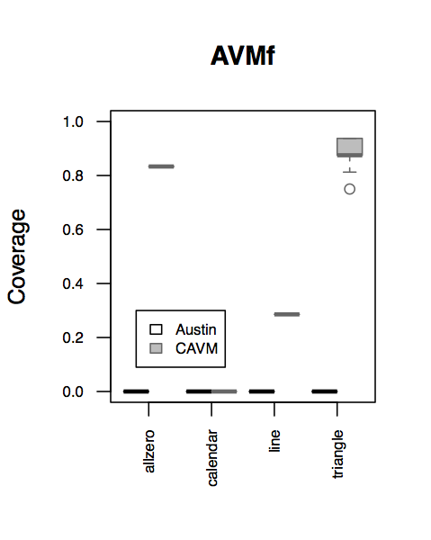
</a>
<a href="./plots/boxplot_time_AVMf.png">
  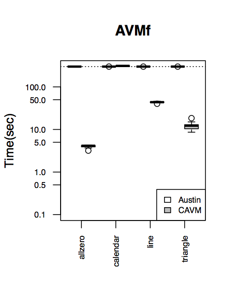
</a>
<a href="./plots/boxplot_eval_AVMf.png">
  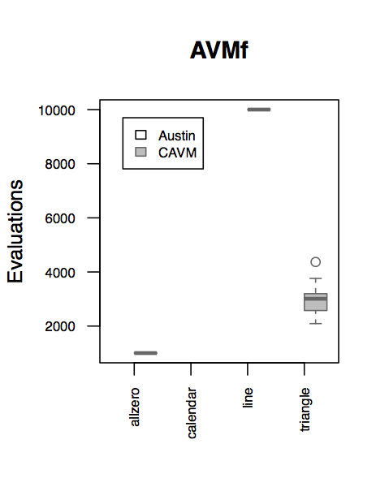
</a>

### Anti-patterns

[Source codes](https://bitbucket.org/snippets/teamcoinse/GrbXK/cavm-anti-patterns)

<a href="./plots/boxplot_cov_antipatterns.png">
  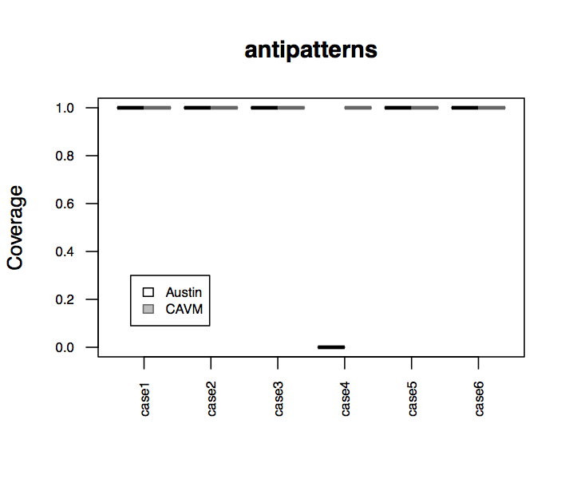
</a>
<a href="./plots/boxplot_time_antipatterns.png">
  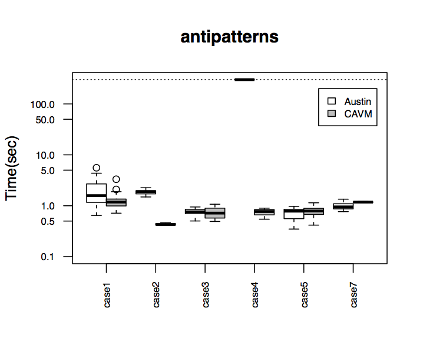
</a>
<a href="./plots/boxplot_eval_antipatterns.png">
  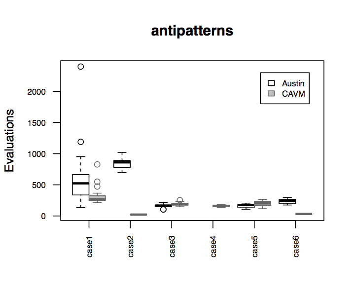
</a>

### Linked List
[Source code](https://bitbucket.org/snippets/teamcoinse/5LpgR/cavm-linked-list)

<a href="./plots/boxplot_cov_linkedlist.png">
  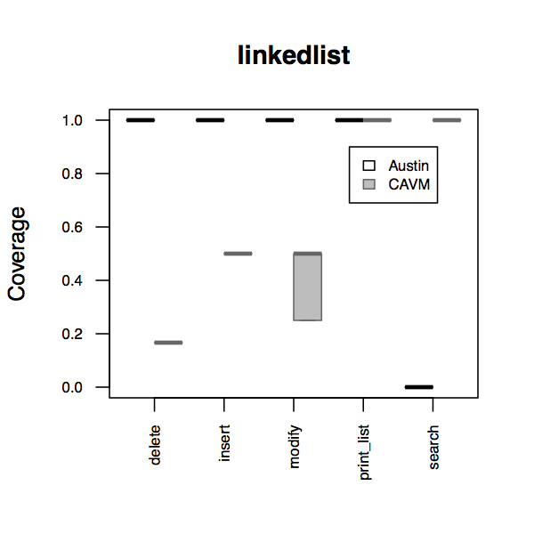
</a>
<a href="./plots/boxplot_time_linkedlist.png">
  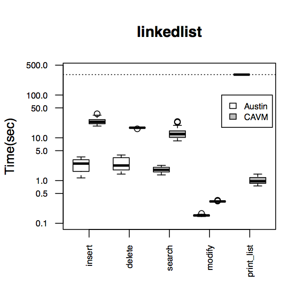
</a>
<a href="./plots/boxplot_eval_linkedlist.png">
  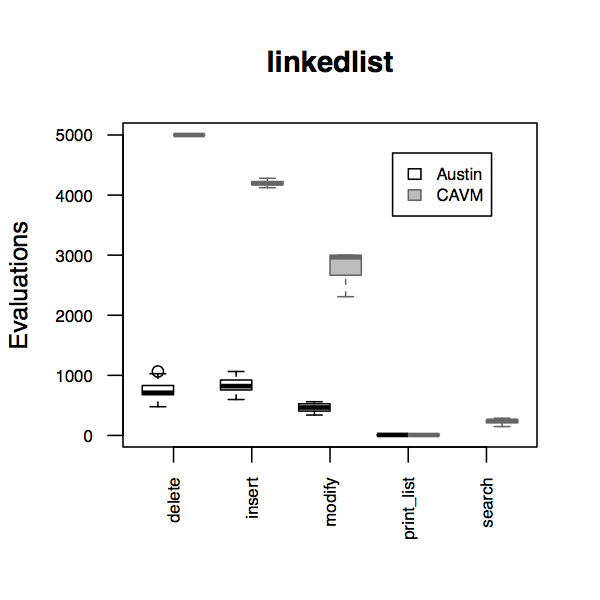
</a>

### Tree
[Source code](https://bitbucket.org/snippets/teamcoinse/XL4dn/cavm-tree)

<a href="./plots/boxplot_cov_tree.png">
  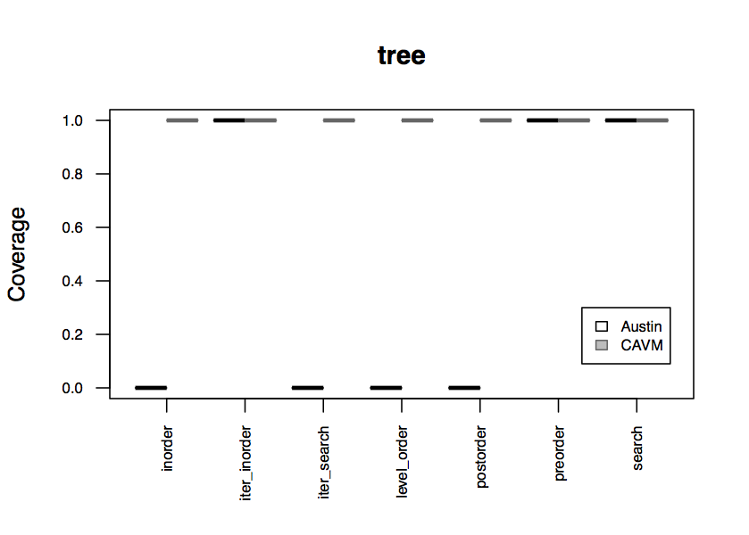
</a>
<a href="./plots/boxplot_time_tree.png">
  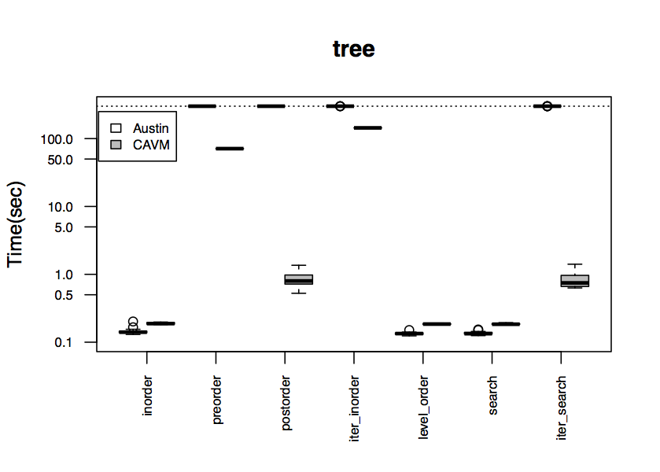
</a>
<a href="./plots/boxplot_eval_tree.png">
  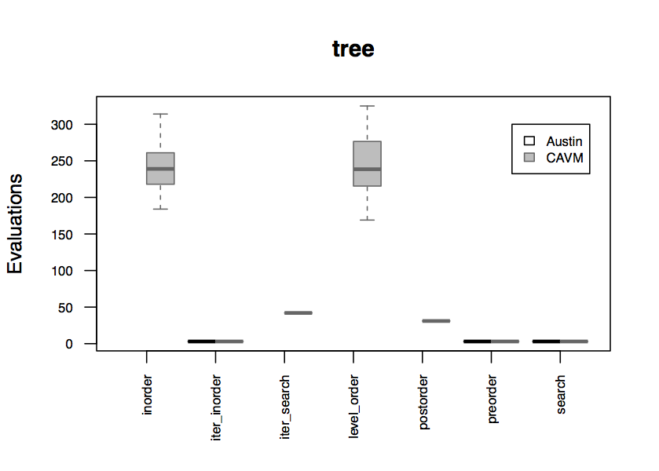
</a>

### Busybox
[Source code](https://bitbucket.org/snippets/teamcoinse/n7XpR/cavm-busybox)

<a href="./plots/boxplot_cov_ls.png">
  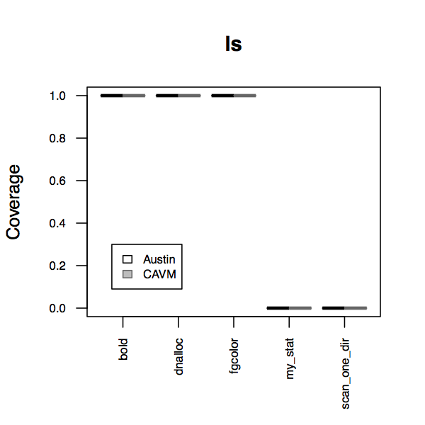
</a>
<a href="./plots/boxplot_time_ls.png">
  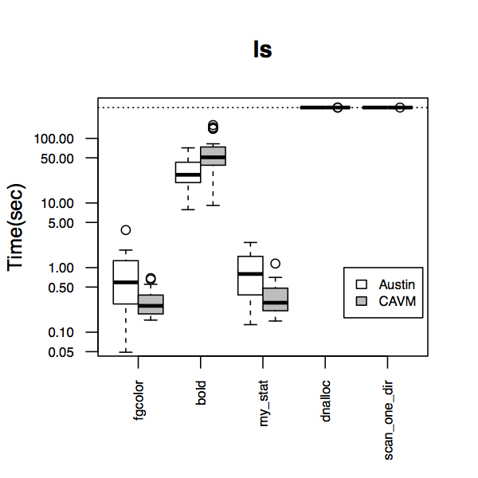
</a>
<a href="./plots/boxplot_eval_ls.png">
  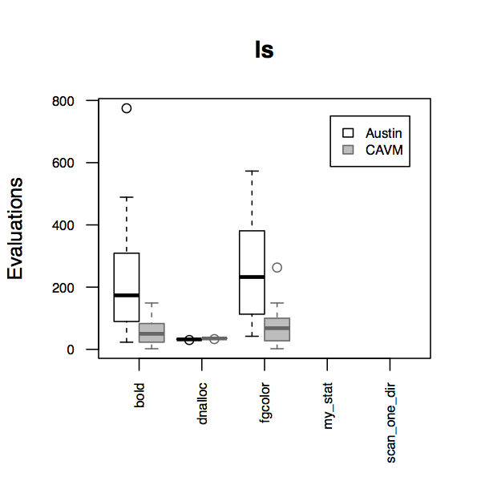
</a>

### Decode
[Source code](https://bitbucket.org/snippets/teamcoinse/jL49K/cavm-decode)

[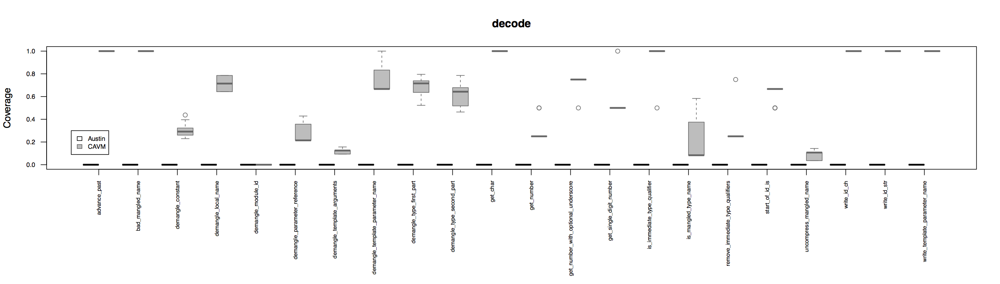](./plots/boxplot_cov_decode.png)
[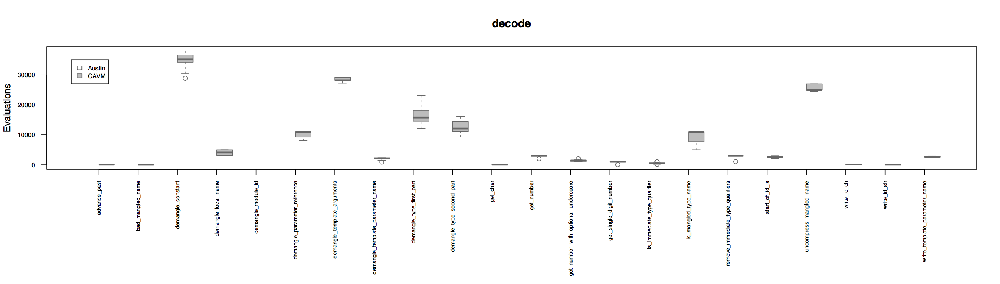](./plots/boxplot_eval_decode.png)
[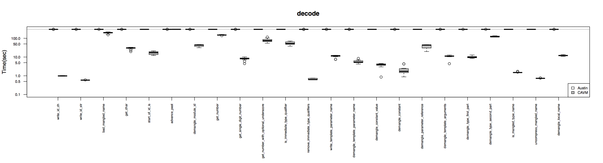](./plots/boxplot_time_decode.png)
